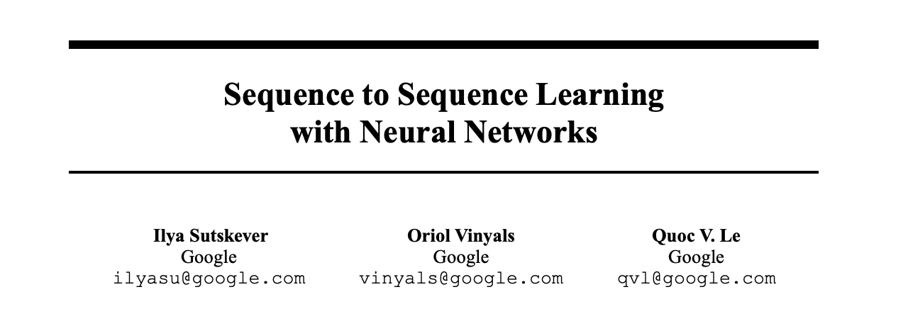

# Seq2Seq Neural Machine Translation

A PyTorch implementation of a Sequence-to-Sequence (Seq2Seq) neural machine translation model for translating German to English. This project uses an Encoder-Decoder architecture with LSTM layers to learn translation patterns from the Multi30k dataset.



## Features

- **Encoder-Decoder Architecture**: LSTM-based encoder and decoder for sequence modeling
- **German to English Translation**: Trained on the Multi30k dataset
- **Interactive Translation Mode**: Real-time translation of user input
- **BLEU Score Evaluation**: Automatic evaluation using BLEU metric
- **TensorBoard Integration**: Training metrics visualization
- **Checkpoint Management**: Automatic saving of best models during training
- **Teacher Forcing**: Configurable teacher forcing ratio for training stability

## Project Structure

```
seq2seq/
├── main.py              # Main entry point for training and inference
├── faran.py             # GPU availability checker
├── requirements.txt     # Python dependencies
├── src/
│   ├── model.py         # Encoder, Decoder, and Seq2Seq model definitions
│   ├── data_utils.py    # Data preprocessing and vocabulary building
│   ├── train.py         # Training loop and checkpoint management
│   ├── evaluate.py      # Translation inference and BLEU evaluation
│   └── utils.py         # Configuration class
└── notebooks/
    └── seq2seq.ipynb    # Jupyter notebook for experimentation
```

## Installation

### Prerequisites

- Python 3.7+
- CUDA (optional, for GPU acceleration)

### Setup

1. Clone the repository:
```bash
git clone <repository-url>
cd seq2seq
```

2. Install dependencies:
```bash
pip install -r requirements.txt
```

3. Download NLTK data (required for BLEU evaluation):
```python
import nltk
nltk.download('punkt')
```

## Usage

### Training the Model

Train the model from scratch:

```bash
python main.py
```

### Interactive Translation

```bash
python main.py translate
```

This will:
1. Download and preprocess the Multi30k dataset
2. Build vocabulary from training data
3. Initialize the Seq2Seq model
4. Train for the specified number of epochs
5. Evaluate on test set and calculate BLEU score
6. Save the best model checkpoint

### Interactive Translation

After training, use the interactive translation mode:

```bash
python main.py translate
```

This allows you to enter German sentences and get English translations in real-time. Type `quit` or `exit` to stop.

### Check GPU Availability

Check if CUDA is available:

```bash
python faran.py
```

## Configuration

Model and training hyperparameters can be adjusted in `src/utils.py`:

```python
# Model hyperparameters
EMB_DIM = 256          # Embedding dimension
HIDDEN_DIM = 512       # Hidden layer dimension
N_LAYERS = 2           # Number of LSTM layers
DROPOUT = 0.5          # Dropout rate

# Training hyperparameters
N_EPOCHS = 10          # Number of training epochs
BATCH_SIZE = 128       # Batch size
LEARNING_RATE = 0.001  # Learning rate
CLIP = 1.0             # Gradient clipping threshold
TEACHER_FORCING_RATIO = 0.5  # Teacher forcing ratio

# Data hyperparameters
MIN_FREQ = 2           # Minimum token frequency for vocabulary
MAX_LEN = 50           # Maximum sequence length
```

## Model Architecture

The Seq2Seq model consists of:

1. **Encoder**: 
   - Embedding layer
   - Multi-layer LSTM
   - Outputs hidden states representing the source sequence

2. **Decoder**:
   - Embedding layer
   - Multi-layer LSTM
   - Linear output layer for vocabulary predictions
   - Uses teacher forcing during training

3. **Training Features**:
   - Teacher forcing with configurable ratio
   - Gradient clipping for stability
   - Checkpoint saving for best validation loss
   - TensorBoard logging for metrics visualization

## Evaluation

The model is evaluated using:

- **BLEU Score**: Corpus-level BLEU score on test set
- **Sample Translations**: Qualitative examples showing source, reference, and predicted translations

Results are displayed during and after training. Checkpoint files are saved in the `checkpoints/` directory, and TensorBoard logs are saved in `runs/seq2seq_experiment/`.

## Monitoring Training

To monitor training progress with TensorBoard:

```bash
tensorboard --logdir runs/seq2seq_experiment
```

Then open your browser to `http://localhost:6006` to view training metrics.

## Dataset

The model uses the **Multi30k** dataset, which contains 30,000 German-English sentence pairs. The dataset is automatically downloaded when you run the training script.

## Dependencies

- `torch==2.2.0` - Deep learning framework
- `torchtext` - Text processing utilities
- `nltk` - Natural language processing
- `tqdm` - Progress bars
- `tensorboard` - Training visualization
- `portalocker==2.8.2` - File locking utilities

## License

[Add your license here if applicable]

## Contributing

[Add contribution guidelines if applicable]

## Acknowledgments

- Multi30k dataset providers
- PyTorch team for the excellent framework